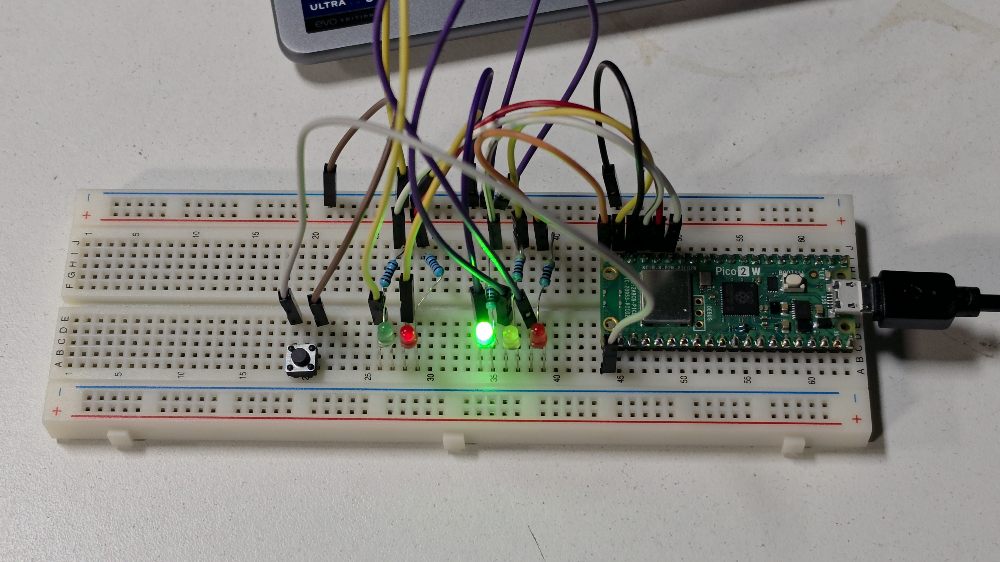
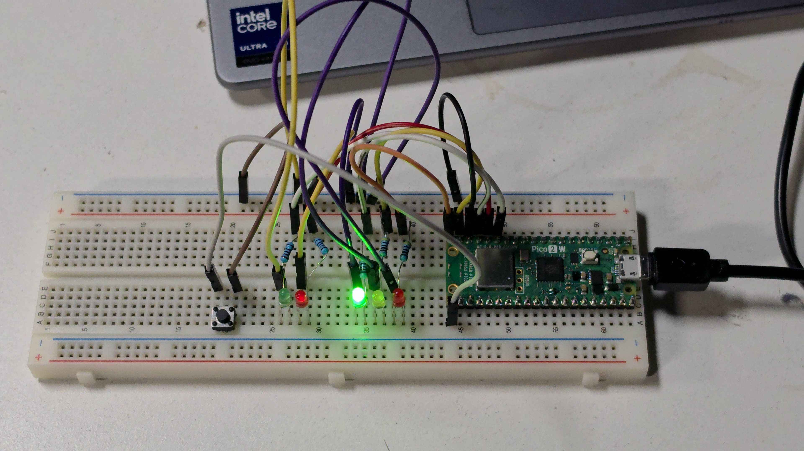
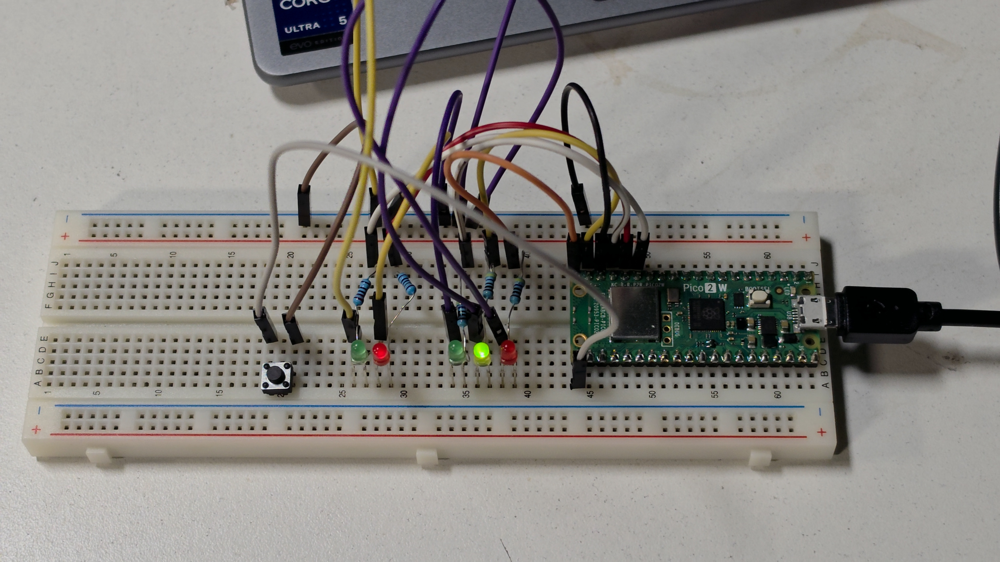
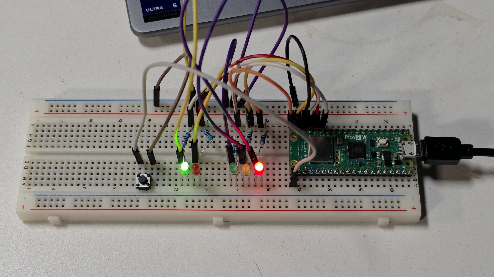
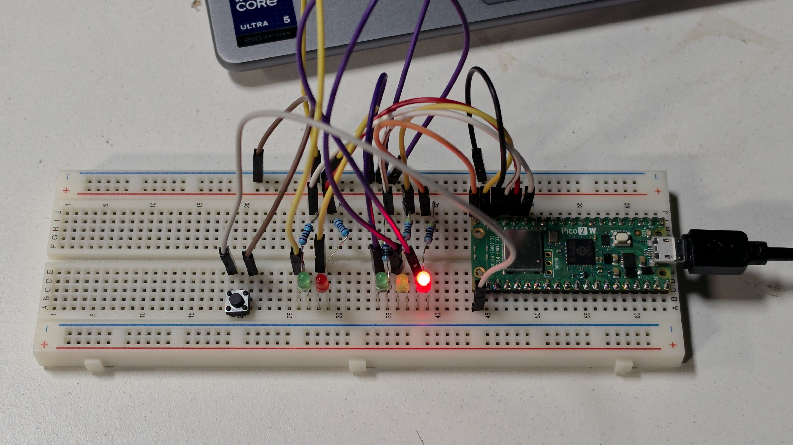

# Sesión 03 — GPIO, pull-up/pull-down y debounce

**Reto 03 — Semáforo peatonal interactivo**
_Angel Rugerio Jiménez · 201720 · Lab. de Elementos Programables_

---

## 1. Objetivo

Construir un semáforo peatonal interactivo sobre la Raspberry Pi Pico donde un **botón** (petición del peatón) dispara una secuencia de estados, cumpliendo siempre la condición de seguridad de que **autos y peatones nunca tienen verde al mismo tiempo**.

El reto cubre los tres bloques de la sesión:

- **Entrada** — leer un botón con pull-up interno (`¿qué ocurre?`)
- **Decisión** — debounce + máquina de estados (`¿qué hago?`)
- **Salida** — cinco LEDs que representan los dos semáforos (`¿cómo respondo?`)

## 2. Circuito

Armado **por etapas**, no de golpe:

- **Etapa A — botón:** `GP16 — BOTÓN — GND`, sin resistencia externa (pull-up interno).
- **Etapa B — LEDs:** `GPIO → 330 Ω → LED → GND`, uno por cada luz.

| Elemento | Pin | Componente |
|---|---|---|
| Auto rojo | GP15 | LED rojo + 330 Ω |
| Auto amarillo | GP14 | LED amarillo + 330 Ω |
| Auto verde | GP13 | LED verde + 330 Ω |
| Peatón rojo | GP12 | LED rojo + 330 Ω |
| Peatón verde | GP11 | LED verde + 330 Ω |
| Botón | GP16 | Pushbutton a GND |

El diagrama completo está en [`wokwi/diagram.json`](./wokwi/diagram.json) y es **el mismo para los cuatro escenarios** (los dos lenguajes × los dos programas): el hardware no cambia entre lenguajes, y `button_read` simplemente no usa los LEDs. El mismo circuito se arma físicamente en protoboard y se pega en el simulador; no hay dos circuitos.

> [!WARNING]
> Las entradas de la Pico son de lógica **3.3 V**. Nunca conectar 5 V directo a un GPIO.

## 3. Funcionamiento

El botón deja de ser "un número" y se convierte en una **petición**. La lógica es una máquina de estados de cuatro estados:

| Estado | Autos | Peatón | Duración |
|---|---|---|---|
| **S0 REPOSO** | VERDE | ROJO | hasta que alguien pulse |
| **S1 TRANSICIÓN** | AMARILLO | ROJO | 1500 ms |
| **S2 CRUCE** | ROJO | VERDE | 4000 ms |
| **S3 FIN** | ROJO | VERDE parpadeando | 4 × 300 ms |

Flujo: `REPOSO → BOTÓN → TRANSICIÓN → CRUCE → FIN → REPOSO`

### Invariante de seguridad

> **Auto verde y peatón verde NUNCA pueden estar activos al mismo tiempo.**

En este proyecto la invariante no se dejó como comentario: está **implementada**. `set_lights()` revisa cada combinación antes de aplicarla y, si detectara `car_green && ped_green`, **descarta el cambio** e imprime la alerta por serial: los LEDs se quedan en el último estado válido y la combinación peligrosa nunca llega a los pines.
Además, al terminar S3 el peatón vuelve a rojo y se espera `RECOVERY_MS` **antes** de devolver el verde a los autos, para que los dos verdes no se traslapen ni por un instante.

### Abstracción

El código no piensa en `0,0,1,1,0` sino en acciones del sistema: `cars_go()`, `cars_prepare_to_stop()`, `pedestrians_go()`, `pedestrians_hurry()`. Eso hace la secuencia legible y reduce las probabilidades de escribir una combinación peligrosa por error.

### Tiempos ajustables

Todos los tiempos son constantes al inicio del archivo (`TRANSITION_MS`, `CROSSING_MS`, `BLINK_TIMES`, `BLINK_MS`, `RECOVERY_MS`). Se pueden modificar sin tocar la lógica y sin romper la seguridad, porque la invariante depende del **orden de los estados**, no de su duración.

## 4. Pull-up / Pull-down

Una entrada digital necesita una **referencia** cuando nadie la usa. Si GP16 no está conectado ni a 0 V ni a 3.3 V, el pin queda **flotante**: no es que "cambie solo", es que **su valor no está garantizado**.

```text
      PULL-UP                    PULL-DOWN
       3.3 V                       3.3 V
         |                           |
        [R]                         BTN
         |                           |
         ├── GP16                    ├── GP16
         |                           |
        BTN                         [R]
         |                           |
        GND                         GND
```

| Configuración | Botón libre | Botón presionado |
|---|---|---|
| **Pull-up** | `1` | `0` |
| **Pull-down** | `0` | `1` |

En esta sesión se usa **pull-up interno**: `GP16 — botón — GND`. Por eso **presionado se lee como `0`**: al cerrar el botón, el pin se conecta directamente a GND y esa conexión le gana al resistor interno de pull-up.

### El rebote (bounce)

Un botón mecánico no cambia de estado limpiamente: los contactos rebotan unos milisegundos y el pin entrega una ráfaga de `1/0`. Físicamente fue **una** presión, pero el programa podría contar varias. La solución usada es debounce por software: detectar el flanco de bajada, esperar 30 ms y **volver a leer**; si sigue en `0`, el click es real. Después se hace **wait for release** para que una presión larga no encadene secuencias. Regla práctica: **1 presión = 1 petición**.

### Mismo concepto, dos lenguajes

| Acción | MicroPython | C/C++ (Pico SDK) |
|---|---|---|
| Entrada con pull-up | `Pin(16, Pin.IN, Pin.PULL_UP)` | `gpio_set_dir(16, GPIO_IN); gpio_pull_up(16);` |
| Leer botón | `button.value()` | `gpio_get(16)` |
| Salida | `Pin(15, Pin.OUT)` | `gpio_set_dir(15, GPIO_OUT)` |
| Escribir LED | `led.value(1)` | `gpio_put(15, 1)` |

## 5. Pruebas realizadas

Cada prueba se corre **dos veces**: en la simulación (wokwi.com, RP2040) y en la placa física (Pico 2 W, RP2350). El código es el mismo en los dos casos, así que una discrepancia entre columnas apunta al hardware —un cable, una resistencia, un pin mal conectado— y no a la lógica. Ese es justamente el motivo de simular primero.

> [!NOTE]
> Las capturas de la simulación están en [`wokwi/`](./wokwi/) y la evidencia del hardware en [`evidence/`](./evidence/). Cada tabla lleva debajo la captura que le corresponde.

### DO 01 — Validación del botón (`01_button_read.py`)

| Estado físico    | Lectura esperada (pull-up) | Wokwi | Física |
| ---------------- | -------------------------- | ----- | ------ |
| Botón libre      | `1`                        | ✅     | ✅      |
| Botón presionado | `0`                        | ✅     | ✅      |
 
Serial de la simulación, con el botón libre (`1`) y presionado (`0`):

| MicroPython | C/C++ |
|---|---|
|  |  |

### DO 02 — Validación del debounce (`02_button_debounce.py`)

| Prueba                   | Resultado esperado                    | Wokwi | Física |
| ------------------------ | ------------------------------------- | ----- | ------ |
| Click corto              | 1 evento                              | ✅     | ✅      |
| Click largo (2 s)        | 1 evento                              | ✅     | ✅      |
| Clicks repetidos rápidos | Sistema estable, sin eventos fantasma | ✅     | ✅      |

Cada presión imprime un solo `CLICK valido`, sin importar cuánto se sostenga:


### CHALLENGE — Validación del semáforo (`03_semaforo_peatonal.py`)

| Prueba                       | Esperado                                       | Wokwi | Física |
| ---------------------------- | ---------------------------------------------- | ----- | ------ |
| Encender el sistema          | Autos verde / peatón rojo (S0)                 | ✅     | ✅      |
| Pulsar una vez               | Ejecuta una secuencia completa S1→S2→S3→S0     | ✅     | ✅      |
| Mantener el botón presionado | No repite la secuencia inmediatamente          | ✅     | ✅      |
| Pulsar varias veces seguidas | Sistema estable                                | ✅     | ✅      |
| Durante el cruce             | Nunca auto verde + peatón verde                | ✅     | ✅      |
| Cambiar `CROSSING_MS` a 6000 | Cruce más largo, secuencia sigue siendo segura | ✅     | ✅      |

Secuencia completa en la simulación, con la traza de estados por serial:


### Transferencia a C/C++

| Prueba            | Esperado                                      | Wokwi | Física |
| ----------------- | --------------------------------------------- | ----- | ------ |
| `button_read.c`   | Mismo `1 / 0` que la versión MicroPython      | ✅     | ✅      |
| `traffic_light.c` | Misma secuencia de estados y misma invariante | ✅     | ✅      |

La misma secuencia, mismo circuito, compilada desde el `.c`:


### Evidencia física (Pico 2 W)

Montaje completo en protoboard, con los cinco LEDs a 330 Ω y el botón a GND:



Los cuatro estados fotografiados sobre la placa real:

| | Estado | Autos | Peatón |
|---|---|---|---|
|  | **S0 REPOSO** | VERDE | ROJO |
|  | **S1 TRANSICIÓN** | AMARILLO | ROJO |
|  | **S2 CRUCE** | ROJO | VERDE |
|  | **S3 FIN** | ROJO | VERDE parpadeando |

El parpadeo de S3 son cuatro fotos, `S3_1` → `S3_4`, alternando la fase apagada y la encendida hasta volver al reposo:

| Foto | Fase | Nota |
|---|---|---|
| [`S3_1.jpg`](./evidence/S3_1.jpg) | verde peatonal **apagado** | autos siguen en rojo |
| [`S3_2.jpg`](./evidence/S3_2.jpg) | verde peatonal **encendido** | archivo idéntico a `S2.jpg`: eléctricamente es el mismo estado |
| [`S3_3.jpg`](./evidence/S3_3.jpg) | verde peatonal **apagado** | segunda fase apagada del parpadeo |
| [`S3_4.jpg`](./evidence/S3_4.jpg) | regreso a **S0** | archivo idéntico a `S0.jpg`: el sistema volvió al reposo |

En ninguna de las fotos aparecen encendidos a la vez el verde de autos (GP13) y el verde de peatón (GP11): es la invariante de seguridad verificada sobre el hardware, no solo en el simulador.

Video de la secuencia completa corriendo sola en la placa (Git LFS, ~185 MB): [`evidence/RE03_video.mp4`](./evidence/RE03_video.mp4).

## 6. Problemas encontrados

> [!NOTE]
> Llenar esta sección con lo que realmente pase al correr las pruebas. Los puntos de abajo son los que ya se resolvieron al armar el proyecto.

- **Un `.uf2` no sirve para las dos cosas.** Wokwi simula un RP2040 y la placa física es una Pico 2 W (RP2350). Al principio el proyecto apuntaba a `PICO_BOARD pico` para poder simularlo con la extensión de VS Code, pero ese binario **no arranca** en la placa real. Es lo que motivó la separación actual: los proyectos de `cpp/` compilan solo para
  `pico2_w`, y la simulación se corre en wokwi.com, que compila su propio binario para RP2040 en la nube. Un solo código fuente, dos compilaciones distintas, cada una para lo suyo.
- **Los cinco LEDs estaban al revés (el problema real del hardware).** 
## 7. Conclusión

La diferencia entre la Sesión 02 y esta es que el programa dejó de ser una secuencia fija y ahora **reacciona al mundo físico**. Lo que más costó no fue el código, sino aceptar dos cosas que no son obvias: que una entrada sin referencia no tiene un valor "aleatorio" sino un valor **no garantizado**, y que un botón mecánico no entrega un flanco limpio.

El debounce y el wait-for-release son la traducción en software de esa realidad eléctrica. Y la invariante de seguridad enseñó algo distinto: en un sistema embebido no basta con que el programa "haga lo que quiero" — hay estados que simplemente **no deben poder existir**, y conviene que el código los bloquee explícitamente en vez de confiar en que la secuencia

---

## Contenido de esta carpeta

| Carpeta / archivo | Contenido |
|---|---|
| `micropython/01_button_read.py` | DO 01 — lectura del botón con pull-up interno |
| `micropython/02_button_debounce.py` | DO 02 — debounce + wait for release |
| `micropython/03_semaforo_peatonal.py` | CHALLENGE — semáforo completo |
| `cpp/button_read/button_read.c` | Proyecto Pico SDK: lectura equivalente del botón en C |
| `cpp/traffic_light/traffic_light.c` | Proyecto Pico SDK: semáforo completo en C |
| `wokwi/` | Circuito (`diagram.json`) para pegar en wokwi.com |
| `evidence/` | Capturas de la simulación y evidencia del hardware |

### Cómo correrlo

Hay **dos entornos** y no se mezclan. El código fuente es el mismo; lo que cambia es quién lo compila y para qué chip.

| | Simulación | Hardware |
|---|---|---|
| Dónde | wokwi.com (IDE web) | Pico 2 W física |
| Chip | RP2040 | RP2350 |
| Compila | Wokwi, en la nube | VS Code + extensión Pico, en local |
| Sirve para | Validar la lógica, capturar el serial | Evidencia real: fotos, video, serial |

#### Simulación — wokwi.com

Se pega el circuito de [`wokwi/`](./wokwi/) y el script (o el `.c`) en el IDE web.
Procedimiento paso a paso y links de los proyectos publicados en
[`wokwi/README.md`](./wokwi/README.md).

No se usa la extensión de Wokwi para VS Code: no simula MicroPython y obligaría a compilar el C para RP2040, que no es el chip de la placa.

#### Hardware — MicroPython

1. Flashear el firmware de MicroPython para **RPI_PICO2_W** (BOOTSEL + arrastrar el `.uf2`).
2. Instalar `mpremote` (`pip3 install --user mpremote`).
3. Correr un script sin instalar nada en la placa:

   ```bash
   mpremote run micropython/01_button_read.py
   ```

4. Para dejarlo autónomo (video del semáforo corriendo solo):

   ```bash
   mpremote cp micropython/03_semaforo_peatonal.py :main.py
   ```

#### Hardware — C/C++

Se compila desde **VS Code** con la extensión *Raspberry Pi Pico*, que es la que pone el toolchain de `~/.pico-sdk/` en el PATH.

1. Abrir `cpp/button_read/` o `cpp/traffic_light/` como carpeta (*File → Open Folder*).
2. Botón *Compile*. El `.uf2` queda en `cpp/<proyecto>/build/`.
3. Conectar la Pico en modo **BOOTSEL** (mantener el botón mientras se enchufa) y copiar, ahí el `.uf2`.
4. Abrir el monitor serial:

   ```bash
   screen /dev/ttyACM0 115200
   ```

   Se sale con `Ctrl-A`, `K`, `y`. Requiere pertenecer al grupo `dialout` (`sudo usermod -aG dialout $USER` y volver a iniciar sesión).